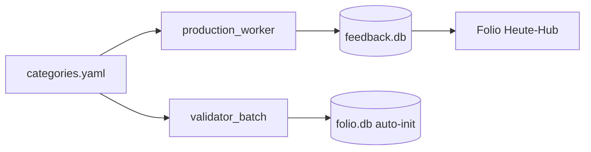

# PILOT.md — Mail-Triage Pilot (multi-agent)

Standalone-Install und Dogfooding-Leitfaden für Fremdrechner / Therapeutin-Pilot.
Lesbar für IT-affine Menschen; ausführbar für AI-Modelle ohne Repo-Vorwissen.

## Architektur-Entscheide

| Entscheid | Begründung |
|-----------|------------|
| **In-place** in `aion-lumen/multi-agent` | Kein Fork — gleiche Pipeline, Config schaltet Domains |
| **Kategorien als YAML** | `config/categories.yaml` ersetzt hartkodierte Domain-Listen |
| **Pilot-Praxis-Preset** | `config/categories.pilot-praxis.yaml` — 4 DE-Praxis-Kategorien |
| **Dogfooding-Quelle** | `<deine-mailadresse>` = Account `mirhamed` in `accounts.toml` |
| **Capability-Entzug** | Netz nur IMAP + LM Studio localhost; kein Cloud-Triage |



## Voraussetzungen

- Python 3.11+, `pip install -r requirements.txt`
- **Zweites Repo:** `life-mail` (IMAP + `accounts.toml`)
- **LM Studio** auf localhost (`LM_STUDIO_BASE_URL`, Default `http://127.0.0.1:1234`)
- Optional: Hermes + Plugin (nur wenn Kanban-Pfad gewünscht; sonst `--no-kanban`)

## Install (< 30 Min)

```bash
# 1. Repos
git clone <aion-lumen> && cd aion-lumen/multi-agent
git clone <life-mail> ~/Projects/life-mail   # Pfad anpassen

# 2. venv + deps
python3 -m venv .venv && source .venv/bin/activate
pip install -r requirements.txt

# 3. Configs
cp config/categories.example.yaml config/categories.yaml   # oder Default behalten
cp config/regelwerk.example.yaml config/regelwerk.yaml
cp config/user_context.example.yaml config/user_context.yaml
# life-mail: accounts.toml mit [accounts.mirhamed] oder Pilot-Account

# 4. Preflight
python scripts/preflight_pilot.py --skip-imap
python scripts/preflight_pilot.py --account mirhamed   # + IMAP-Test

# 5. Demo
make demo-pilot

# 6. Echter Lauf (heuristic-only, ohne Hermes)
python scripts/production_worker.py \
  --account mirhamed --mode silent --no-telegram --no-kanban \
  --tranche-size 50
```

## Config-Referenz

### `config/categories.yaml`

Pro Kategorie:

| Feld | Bedeutung |
|------|-----------|
| `key` | Domain-ID in `feedback.domain` |
| `label` / `description` | UI + Validator-Prompt |
| `sender_domains` | Absender-Domain-Match |
| `subject_keywords` | Wortgrenzen-Match im Betreff |
| `priority_subject_keywords` | z.B. Paketzustellung (immer actionable) |
| `sender_prefixes` | Newsletter/Marketing-Prefix |
| `domain_tokens` | Substring in Domain (System-Brands) |
| `match_non_bulk_sender` | Privatpersonen → `kontakt` |
| `default_actionability` | Worker-Default |
| `priority_boost` | z.B. `hauskauf` → archive→actionable |
| `is_fallback` | Catch-all-Kategorie |

**Pilot-Praxis:** `CATEGORIES_YAML=config/categories.pilot-praxis.yaml`

### `accounts.toml` (life-mail)

```toml
[accounts.mirhamed]
host = "imap.example.com"
port = 993
login = "<deine-mailadresse>"
bw_item = "life-mail/mirhamed"          # Default: Bitwarden
# password_env = "MIRHAMED_IMAP_PASSWORD"  # Alternative
# password_cmd = "pass show mail/mirhamed"   # Alternative
```

### Umgebungsvariablen

| Variable | Default | Zweck |
|----------|---------|-------|
| `LM_STUDIO_BASE_URL` | `http://127.0.0.1:1234` | Validator + Plugin |
| `CATEGORIES_YAML` | `config/categories.yaml` | Domain-Set |
| `FEEDBACK_DB_PATH` | `state/feedback.db` | Triage-Output |
| `FOLIO_DB_PATH` | `~/.folio/folio.db` | Validator-Opinions |
| `LIFE_MAIL_ACCOUNTS_TOML` | `~/Projects/life-mail/accounts.toml` | IMAP |

## Worker-Flags (Pilot)

| Flag | Wirkung |
|------|---------|
| `--no-kanban` | Kein Hermes; Plugin übersprungen; nur Heuristik |
| `--dry-run` | Kein DB-Write, keine Side-Effects |
| `--imap-fixture` | Offline-JSON statt Live-IMAP |
| `--mode silent` | Kein Telegram |

`classify_immo()` läuft **nur** wenn Kategorie `immo` in `categories.yaml` existiert.

## Preflight

```bash
make preflight
# oder
python scripts/preflight_pilot.py --account mirhamed
```

Prüft: Configs, `state/` schreibbar, LM Studio, optional IMAP-Login.

## Demo-Datensatz

**`tests/fixtures/imap/demo_praxis.json`** — 25 **fiktive** deutsche Praxis-Mails.
Keine echten Dritt-Inhalte. Nur für Demo/Tests.

```bash
make demo-pilot
```

## Troubleshooting

| Symptom | Fix |
|---------|-----|
| `bw` not in PATH | `password_env` oder `password_cmd` in accounts.toml |
| `hermes` not in PATH | `--no-kanban` (Pilot-Default) |
| `folio.db` crash | Auto-Init aus `data/schemas/folio.schema.sql` (Validator) |
| LM Studio unreachable | Server starten, `LM_STUDIO_BASE_URL` prüfen |
| Leere Heute-Karte | Worker-Lauf + `mail_date` heute in feedback.db |

## Sicherheit: Capability-Entzug statt Filterung

**Produktions-Pfad (scripts/, 2026-07-07 Audit):**

| Endpoint | Skript | Optional |
|----------|--------|----------|
| IMAP (account host) | `production_worker`, `imap_cleanup`, `preflight_pilot` | — |
| `LM_STUDIO_BASE_URL` (localhost) | `validator_batch`, `production_worker` preflight | — |
| `HERMES_API_URL` (localhost) | `validator_batch` (Legacy-Fallback) | Ja |
| Telegram API | `feedback_telegram` | Nur `--mode learning` |
| Hermes Kanban CLI | `production_worker` | Nur ohne `--no-kanban` |

**Nicht im Pilot-Pfad:** `fetch_demo_photos.py` (picsum), `_archive/*`.

Kein Cloud-Triage, kein Auto-Send. Daten bleiben lokal (feedback.db, folio.db).

## Dogfooding (der Steward)

- Account: `mirhamed` (`<deine-mailadresse>`)
- Folio Heute-Hub: Tageszähler je Kategorie + Top-5 actionable
- Verifikation: `pytest tests/test_mirhamed_worker.py`

## Siehe auch

- `README.md` — Pipeline-Überblick
- `docs/quickstart.md` — Demo Alex+Maya
- `make help` — alle Targets
