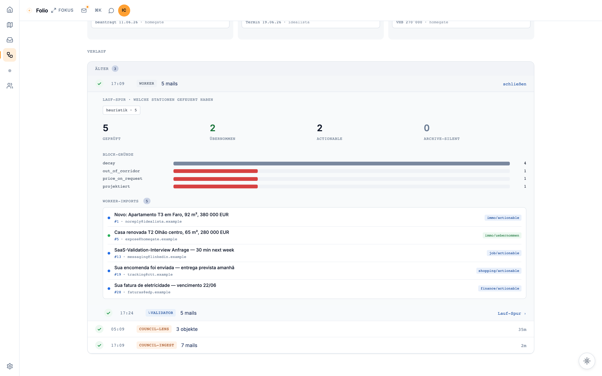

# multi-agent-lab

Mail classification pipeline for the **Aion Lumen** ecosystem: heuristic worker, three-voice LLM validator, auto-promotion, and optional IMAP cleanup. Orchestrated by [folio](https://github.com/aion-lumen/folio) for UI runs (Direktive D: one run = one phase).

## System map

```
folio (SvelteKit UI)
  │ spawn
  ▼
production_worker.py  ──► feedback.db (heuristic classifications)
  │
  │ manager.ts reads classified mail_ids
  ▼
validator_batch.py  ──► folio.db (validator_opinions, worker_run_logs)
  │
  ├── auto_uebernahme.py
  └── imap_cleanup.py (yahoo + regelwerk gate)
```

| Database | Owner writes | Cross-readers |
|---|---|---|
| `state/feedback.db` | multi-agent scripts | folio (read) |
| `~/.folio/folio.db` | folio + cross-DB writers | multi-agent (logs, opinions) |
| `~/.council/council.db` | council worker | folio (read) — optional companion, not required for the demo |

See `docs/cross-db-write-ausnahmen.md` for allowed cross-DB writes.

## Layout

| Path | Purpose |
|---|---|
| `scripts/` | Live pipeline (worker, validator, heuristics) |
| `scripts/migrations/` | One-shot schema / data migrations |
| `scripts/_archive/` | Forensic / audit tools (not part of daily ops) |
| `config/` | `*.example.yaml` tracked; real `regelwerk.yaml` / `user_context.yaml` / `immo_whitelist.yaml` are local, gitignored |
| `tests/` | pytest smoke + unit tests |
| `state/` | Runtime DBs / logs / telemetry — gitignored, auto-created at first worker run |

## Quickstart

Set up the Python environment, copy example configs, then run the heuristic worker offline against a fixture:

```bash
python3 -m venv .venv && source .venv/bin/activate
pip install -r requirements.txt

cp config/user_context.example.yaml config/user_context.yaml
cp config/immo_whitelist.example.yaml config/immo_whitelist.yaml
cp config/regelwerk.example.yaml config/regelwerk.yaml

python scripts/production_worker.py --dry-run --no-telegram \
  --imap-fixture tests/fixtures/imap/demo_quickstart.json --tranche-size 2
```

Full guide (incl. `make demo` seed for the folio UI demo): [docs/quickstart.md](docs/quickstart.md)

**Pilot / Fremdrechner:** [PILOT.md](PILOT.md) — Install < 30 Min, `make demo-pilot`, `make preflight`.

## Sicherheit: Capability-Entzug statt Filterung

Produktions-Pfad (`scripts/`, kein `_archive/`): Netz nur **IMAP** (Account-Host) + **LM Studio** (`LM_STUDIO_BASE_URL`, Default localhost). Optional: Hermes localhost, Telegram (nur Learning-Mode). Kein Cloud-Triage, kein Auto-Send. Details: [PILOT.md § Sicherheit](PILOT.md#sicherheit-capability-entzug-statt-filterung).

## Screenshots (from folio UI)

The pipeline is orchestrated and observed via folio's UI. Captured against the bundled demo state (`make demo`).

<p align="center">
  
  <br><sub><em>Pipeline overview — data-flow from IMAP through worker, validator, auto-übernahme into the Council pool. Council ist eine private Erweiterung des Betreibers und nicht Teil dieses Repos.</em></sub>
</p>

<p align="center">
  
  <br><sub><em>Validator mid-run — three blind LLM voices (gemma-control · qwen35b-lens · qwen-validator), Delphi-Prinzip (no voice sees another's verdict).</em></sub>
</p>

<p align="center">
  
  <br><sub><em>Run detail — per-mail Block-Gründe (out_of_corridor, decay, projektiert, price_on_request) + sampled worker-imports.</em></sub>
</p>

## Environment

| Variable | Default | Required for |
|---|---|---|
| `FEEDBACK_DB_PATH` | `<repo>/state/feedback.db` | demo + prod |
| `FOLIO_DB_PATH` | `~/.folio/folio.db` | demo + prod |
| `COUNCIL_DB_PATH` | `~/.council/council.db` | demo + prod |
| `MULTI_AGENT_CONFIG_DIR` | `<repo>/config` | demo + prod |
| `CATEGORIES_YAML` | `<repo>/config/categories.yaml` | pilot domain sets |
| `LM_STUDIO_BASE_URL` | `http://127.0.0.1:1234` | validator + plugin |
| `AION_LUMEN_PATH` | `~/Projects/aion-lumen/multi-agent` | folio-side handoff (demo + prod) |
| `LIFE_MAIL_ACCOUNTS_TOML` | `~/Projects/life-mail/accounts.toml` | prod only (live IMAP) |

## License

MIT — see [LICENSE](LICENSE).
